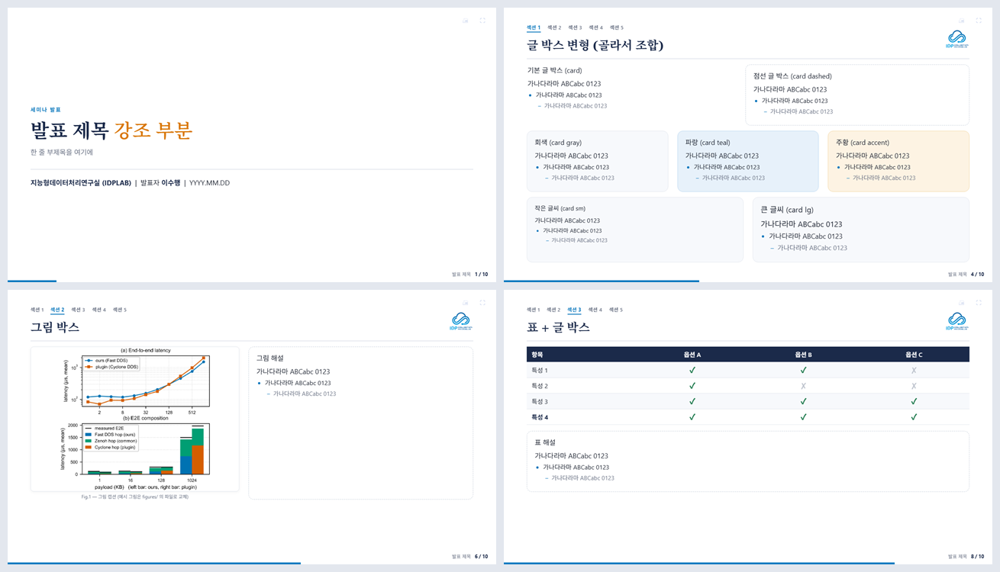

# presentation-template

**AI에게 맡기는 발표자료 — PowerPoint 대신 HTML로 만드는 16:9 슬라이드 덱 템플릿.**

말로 시키면 AI가 만든다. 당신은 코드를 한 줄도 몰라도 된다.



<p align="center"><sub>표지 · 글 박스 변형 · 그림 배치 · 표 — 모두 같은 템플릿의 컴포넌트 조합</sub></p>

---

## 왜 PPT가 아니라 HTML인가

발표자료의 표준은 오랫동안 PowerPoint였지만, 지금은 **AI에게 자료를 맡기는 시대**다.
그리고 PPT는 AI에게 불편한 도구다. Claude·Codex 같은 AI는 `.pptx`를 직접 다루지 못해
**파이썬 스크립트로 간접 제어**(python-pptx 등)하는데, "글자 색 바꿔줘" 같은 간단한 요청조차
좌표·객체를 코드로 더듬는 비효율적 우회이고, 결과가 어떻게 보일지 가늠하기도 어렵다.

반대로 **웹(HTML·CSS·JS)은 AI의 모국어에 가깝다.** 방대한 프론트엔드 코드를 학습한 AI는
이미 **웹 디자인을 잘하고 입출력도 편하다.**

> 그래서 아이디어는 간단하다 — **발표자료를 HTML 양식으로 만들어 두면, AI에게 시키기가
> 압도적으로 수월하다.** 한번 내게 맞는 양식을 잡으면, 그다음부터는 말로만 시키면 된다.

빌드 도구도, 인터넷도, 의존성도 없다. `template.html` 하나를 브라우저에서 열면 그대로 발표가
된다. 1280×720 스테이지를 화면에 맞춰 자동 스케일하고, 글 박스·그림·표·수식·인터랙티브
시뮬 같은 컴포넌트를 미리 갖췄다.

---

## 핵심: 당신은 코드를 몰라도 된다

저장소에는 AI(Claude)용 작업 지침서 [`CLAUDE.md`](CLAUDE.md)가 들어 있고, 모든 컴포넌트
사용법이 거기 적혀 있다. **그 코드를 외울 건 AI지 당신이 아니다.** 당신은 만들고 싶은 슬라이드를
**말로 설명**하면 AI가 맞는 컴포넌트를 골라 조립한다.

슬라이드 만들기는 늘 세 가지를 고르는 일이고, 셋 다 자연어로 넘기면 된다:

1. **레이아웃** — 그림·글을 어디에 (한 덩어리 / 좌우 2단 / 왼쪽 그림·오른쪽 글 …)
2. **글 박스 모양** — 강조 정도 (그냥 내용 / 회색 / 파란·주황 강조 / 점선 해설 …)
3. **내용** — 무슨 말을 쓸까

---

## 어떻게 시키면 되나 (지시 예시)

정해진 문법은 없다. **평소 말투**로 적으면 AI가 `CLAUDE.md`를 참고해 구현한다.

- **시작** — "이 템플릿으로 'OO 세미나' 덱 새로 만들어줘. 표지·목차 채우고 본문 5장 정도."
- **레이아웃+내용** — "다음 장은 **왼쪽 그림, 오른쪽 설명 글 박스**. 제목 '시스템 구조',
  오른쪽엔 구성요소 3개를 들여쓰기로."
- **표 비교** — "A안·B안을 항목별 ✓/✗ **표로 비교**하고, 아래 점선 박스에 결론 한 줄."
- **강조** — "여기는 **파란 강조 박스 하나**로 크게, 핵심 메시지만."
- **수정** — "6페이지 그림을 `figures/result.png`로 교체", "3페이지 넘치면 줄여줘."
- **분위기** — "전체 강조색을 파랑 대신 보라색 계열로."

AI는 슬라이드를 짠 뒤 16:9에서 잘리는 곳(overflow)이 없는지까지 스스로 확인한다.

---

## 만들 수 있는 것들

코드는 외울 필요 없다 — "이런 것도 되는구나" 정도면 된다.

- **글 박스** — 내용만 / 회색 / 파란·주황 강조 / 점선 해설, 글씨 작게·보통·크게.
  안은 PowerPoint처럼 **들여쓰기**로 단계를 나눈다.
- **레이아웃** — 한 덩어리, 좌우 2·3단, 좌우 그림+글, 위 큰 그림+아래 글.
- **그림·표** — 캡션 그림, 풀폭 긴 그림 / 헤더·줄무늬 자동 표, 비교용 ✓/✗.
- **수식** — 간단한 건 글자로(σ Σ θ), 복잡한 건 이미지·LaTeX로. 인터넷 없이도 OK.
- **인터랙티브 시뮬** — 발표 중 **드래그·슬라이더로 조작하는 데모**(예: 3D 회전).

---

## 발표·저장

- **넘기기:** `←/→` · `Space` · `PageUp/Down` · 화면 좌/우 클릭 — `Home/End` 처음·끝 · `F` 전체화면.
- **PDF 저장:** 우상단 `🖨`(또는 `Ctrl/⌘+P`) → 대상 **"PDF로 저장"**, 여백 **"없음"** →
  슬라이드 한 장이 **16:9 한 페이지**로 떨어진다(벡터·텍스트 선택 가능, 별도 설치 없음).

---

## 구조

```
template.html   본체 (이것만 열면 됨)
README.md       이 문서 (사람용 — 아이디어와 시키는 법)
CLAUDE.md       AI(Claude)용 컴포넌트·작업 가이드
figures/        예시 그림 · 로고
simulations/    예시 인터랙티브 3D 시뮬 (단일 HTML)
LICENSE         MIT
```

색·글꼴은 `template.html` 상단 `:root` 토큰만 바꾸면 전체 반영된다(`--teal` 파랑, `--accent`
주황). `figures/`의 `example-*`는 자리표시용이니 본인 자료로 교체해 쓴다.

## License

[MIT](LICENSE) © 2026 이수행 (Lee Su-haeng), IDPLAB
